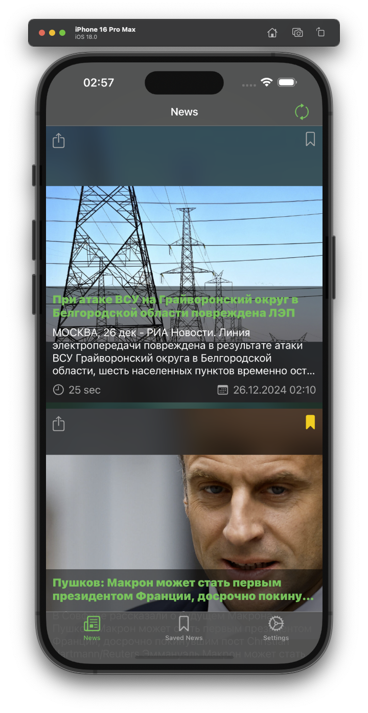
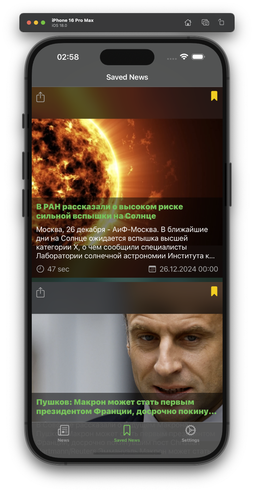
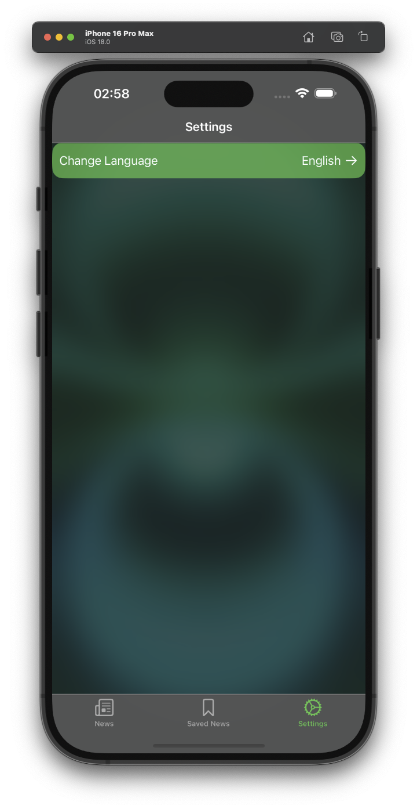
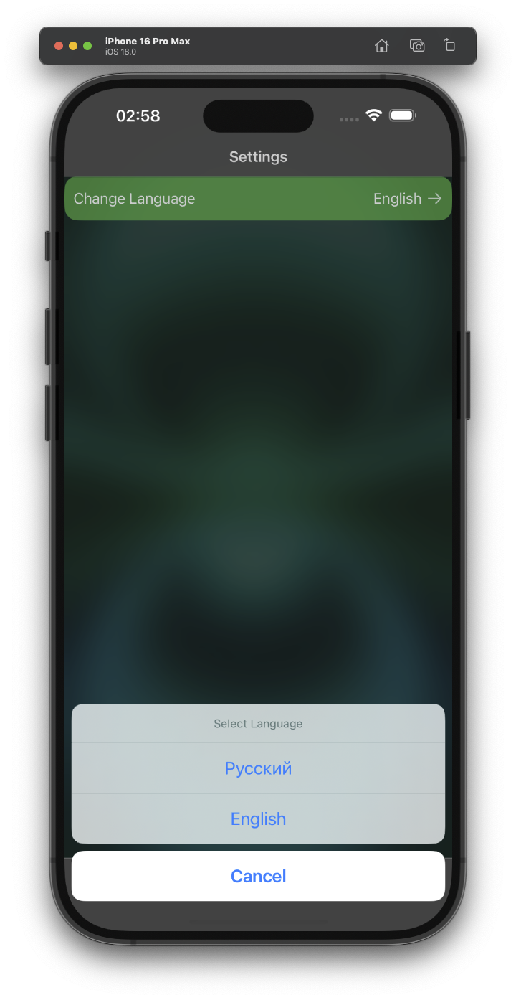
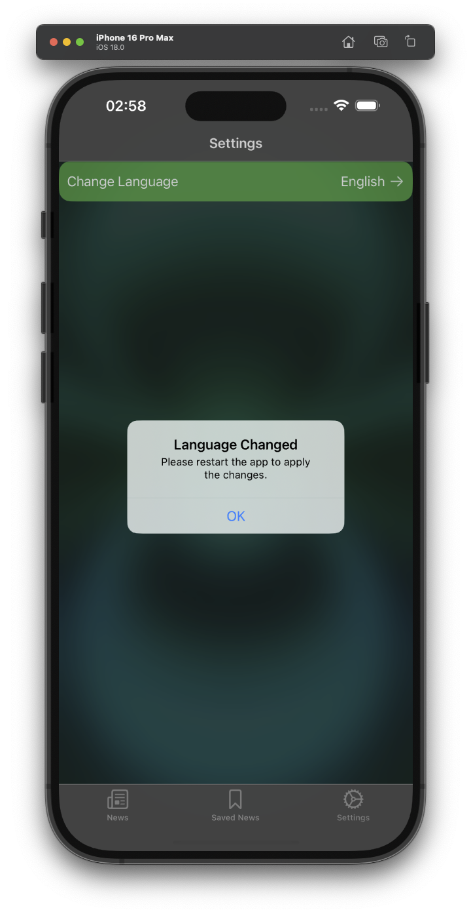
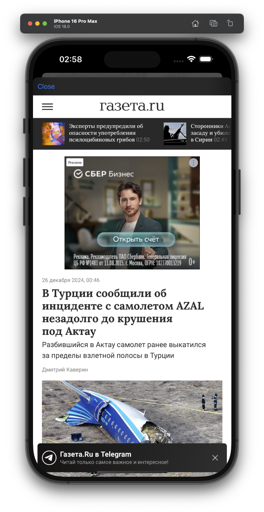
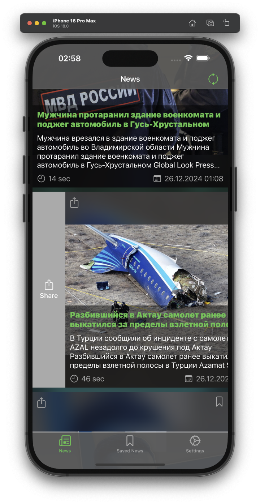
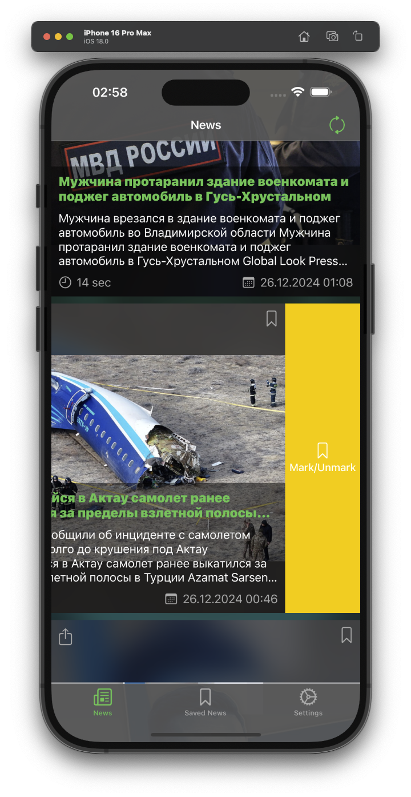
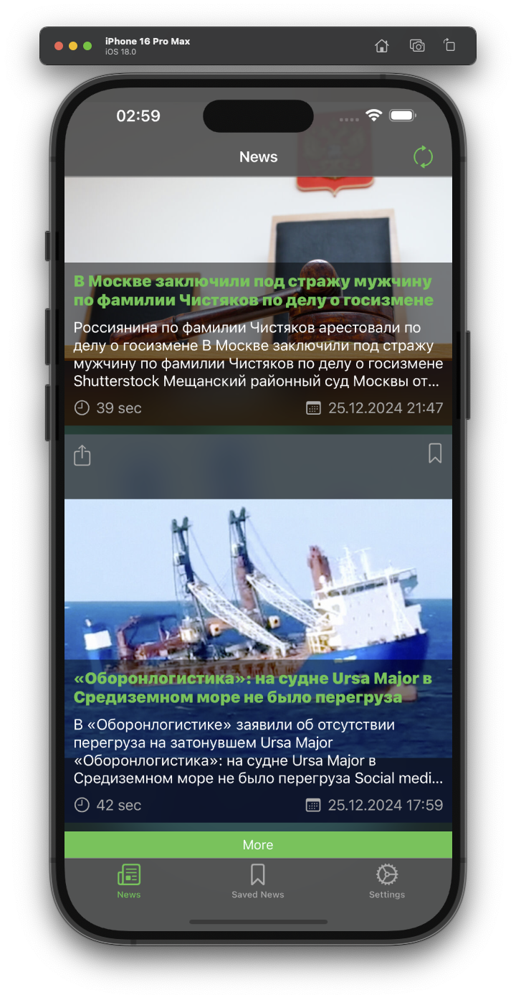
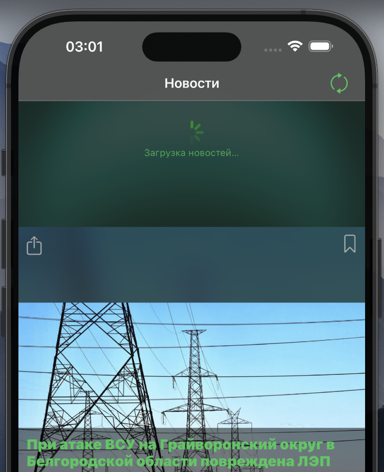

<h1 align="center">PW5</h1>

  Главный экран  
   
    

  Экран сохраненных новостей  
   
    

  Экран настроек  
   
    

  Возможность смены языка  
   
   

  Уведомление о необходимости смены языка  
   
    

  Возможность открыть веб-представление новости при нажатии на нее  
   
  

  Возможность поделиться ссылкой на новость при свайпе вправо (также есть кнопка)  
   
  

  Возможность сохранить новость при свайпе влево (также есть кнопка)  
   
   

  Возможность загрузить больше новостей  
   
    

  Обновление новостей при свайпе вниз или при нажатии кнопки  
   
    

